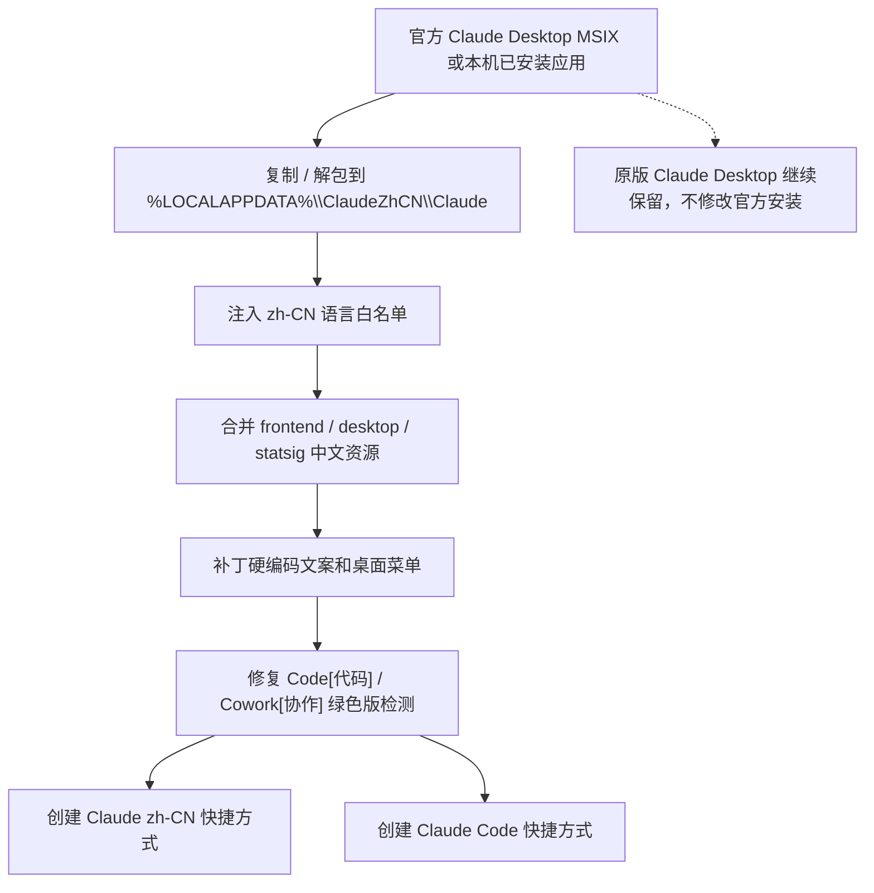
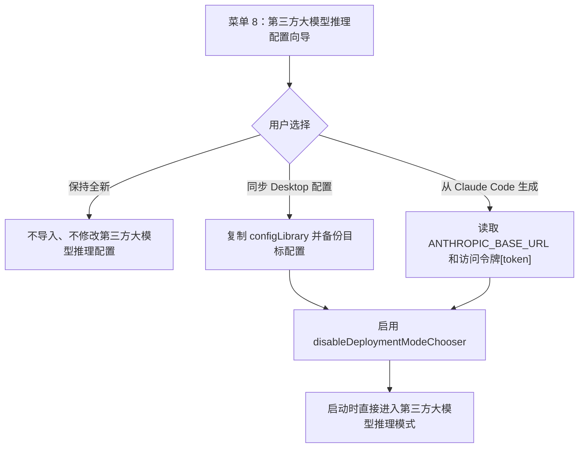

# WIN CC Desktop zh-CN Portable

一键生成可与官方安装版共存的中文绿色版 CC Desktop。

它会从官方 Windows MSIX 或本机已安装应用生成一个独立的中文副本，放在 `%LOCALAPPDATA%\ClaudeZhCN` 下运行。原版 Claude Desktop 不会被修改，汉化版和原版可以共存。

即使你没有安装过 Claude Desktop，也可以通过本工具下载官方 MSIX 并生成中文绿色版。仓库只包含补丁脚本和翻译资源，不包含官方应用、安装包、账号数据或访问令牌。

> CC 在本项目中指 Claude/Claude Code 相关桌面体验的缩写。本项目是独立社区工具，非官方项目。发布或使用前请阅读 [DISCLAIMER.md](DISCLAIMER.md)。

## 项目特色

- 独立绿色副本：默认安装到 `%LOCALAPPDATA%\ClaudeZhCN\Claude`，不覆盖官方安装。
- 中文化体验：合并前端中文资源，并补丁处理部分硬编码菜单、设置页、Code[代码] / Cowork[协作] 文案。
- 配置选择权：第三方大模型推理配置向导可以保持全新，也可以同步 Claude Desktop 或 Claude Code 的已有配置。
- 可跳过登录模式选择：导入或生成配置后，工具会启用 `disableDeploymentModeChooser`，直接进入第三方大模型推理模式。
- 原版共存：开始菜单里的原版 Claude 仍然是英文官方版，`Claude zh-CN` 快捷方式启动的是中文绿色版。
- Code[代码] / Cowork[协作] 兼容：修复绿色版路径下 Code[代码] / Cowork[协作] 对 MSIX 安装路径的检测。
- 快捷方式自动创建：首次汉化或更新后自动创建 `Claude zh-CN` 和 `Claude Code` 的桌面 / 开始菜单快捷方式。
- 更新友好：版本相同则跳过下载；官方下载接口异常时会回退到本机已安装 Claude。

## 工作方式

汉化版不会改动官方安装目录，而是生成一个独立副本后再补丁资源：



第三方大模型推理配置默认不会强行导入，用户自己选择：



## 快速开始

推荐双击英文菜单入口，兼容 Windows PowerShell 5.1：

```text
cc_desktop_tool.bat
```

选择：

```text
1. Patch / update / launch zh-CN Claude
```

中文菜单入口也可使用：

```text
cc_desktop_tool_zh.bat
```

如果你喜欢 PowerShell：

```powershell
cd C:\Users\TC\Downloads\claude-desktop-zh-cn-main
.\cc_desktop_tool.ps1
```

首次运行选项 `1` 后，工具会自动执行：检查版本、生成中文副本、应用中文资源、启用 Developer Mode[开发者模式]、创建快捷方式并启动汉化版。

如果检测到可复用的第三方大模型推理配置，工具会询问是否打开配置向导。直接选 `N` 或回车即可保持全新配置，之后也可以通过菜单 `8` 再打开向导。

## 默认路径

绿色版应用：

```text
%LOCALAPPDATA%\ClaudeZhCN\Claude\Claude.exe
```

下载缓存：

```text
%LOCALAPPDATA%\ClaudeZhCN\downloads\Claude-latest.msix
```

启动器：

```text
%LOCALAPPDATA%\ClaudeZhCN\launch_claude_zh_cn.vbs
```

用户数据：

```text
%APPDATA%\Claude
%APPDATA%\Claude-3p
%LOCALAPPDATA%\Packages\Claude_*\LocalCache\Roaming\Claude
%LOCALAPPDATA%\Packages\Claude_*\LocalCache\Roaming\Claude-3p
```

快捷方式：

```text
桌面\Claude zh-CN.lnk
桌面\Claude Code.lnk
开始菜单\Claude zh-CN.lnk
开始菜单\Claude Code.lnk
```

`Claude Code.lnk` 只有在本机能找到 `claude` 命令时才会自动创建。

## 菜单

英文菜单：

```text
1. Patch / update / launch zh-CN Claude
2. Check latest version
3. Locate user config/account data
4. Clean user config/account data
5. Launch patched Claude
6. Create Claude and Claude Code shortcuts
7. Full clean portable zh-CN tool files
8. Third-party model inference config wizard
9. Apply Cowork compatibility fix
0. Exit
```

中文菜单：

```text
1. 汉化 / 更新 / 启动汉化版
2. 检查版本更新
3. 定位用户配置/账号数据
4. 清理用户配置/账号数据
5. 启动汉化版 Claude
6. 创建 Claude 和 Claude Code 快捷方式
7. 完全清理绿色版文件
8. 第三方大模型推理配置向导
9. 应用 Cowork 兼容修复
0. 退出
```

## 更新逻辑

选项 `1` 会先检查官方最新版和本地绿色副本版本。

如果版本一致，工具会跳过下载和重建，只重新应用中文资源、用户界面设置、Cowork 兼容修复和快捷方式。

如果版本不同，工具会询问是否更新。确认后会下载官方最新版 MSIX，备份旧绿色副本，并重新生成新的中文副本。

如果官方下载接口返回 403 或版本检查失败，菜单会尝试回退到本机已安装的 Claude Desktop 继续生成绿色版。没有安装官方版时，可以稍后重试下载，或手动提供 MSIX。

## 第三方大模型推理配置向导

菜单 `8` 用来处理 Desktop 的 `Developer -> Configure Third-Party Inference[第三方大模型推理]` 配置。默认安装 / 更新不会强行导入第三方配置，只有你在向导里确认后才会写入。

向导提供几种选择：

```text
1. 保持全新：不导入、不修改第三方大模型推理配置。
2. 同步 Claude Desktop configLibrary：适合复用官方安装版里已经配置好的 Desktop 第三方大模型推理。
3. 从 Claude Code 配置生成：读取 Claude Code 里的 gateway[网关] 地址和访问令牌[token]，转换成 Desktop 可用的配置。
4. 只查看：显示检测到的配置来源和当前绿色版配置。
```

可能读取的 Desktop 配置库：

```text
%APPDATA%\Claude-3p\configLibrary
%LOCALAPPDATA%\Packages\Claude_*\LocalCache\Roaming\Claude-3p\configLibrary
```

可能读取的 Claude Code 配置：

```text
%USERPROFILE%\.claude\settings.json
%USERPROFILE%\.claude\settings.local.json
```

识别字段：

```text
ANTHROPIC_BASE_URL
ANTHROPIC_AUTH_TOKEN
ANTHROPIC_API_KEY
```

两种同步方式不是完全一样的：

- Desktop -> Desktop：复制同类 `configLibrary` JSON 文件，更适合已经在官方 Claude Desktop 里配置成功的用户。
- Claude Code -> Desktop：只读取 `ANTHROPIC_BASE_URL` 和访问令牌[token] / API key，再生成 Desktop gateway[网关] 配置；它不是完整搬运 Claude Code 的所有设置。

写入目标是绿色版优先使用的配置库：

```text
%APPDATA%\Claude-3p\configLibrary
```

同步前会备份目标配置库到：

```text
%LOCALAPPDATA%\ClaudeZhCN\user-data-backups
```

导入或生成配置后，工具会启用 `disableDeploymentModeChooser`，让绿色版启动时直接进入第三方大模型推理模式，减少第一次启动时的登录模式选择。敏感值在控制台输出时会打码。

如果没有检测到可复用配置，工具只会提示，不会写入空配置。

## Code[代码] / Cowork[协作] 兼容修复

Windows 版本的 Code[代码] / Cowork[协作] 页面会检测应用是否通过 MSIX / WindowsApps 路径启动。绿色版是解包运行，可能出现：

```text
Cowork requires Claude Desktop be installed with our modern installer
```

选项 `9` 会把该检测改为读取绿色版专用环境变量，并同步更新 ASAR 完整性信息与 `Claude.exe` 中记录的 ASAR hash。

修复时会备份：

```text
%LOCALAPPDATA%\ClaudeZhCN\Claude\resources\app.asar.bak-before-cowork-compat-*
%LOCALAPPDATA%\ClaudeZhCN\Claude\Claude.exe.bak-before-cowork-compat-*
```

请通过桌面或开始菜单中的 `Claude zh-CN` 快捷方式启动。不要直接双击绿色副本里的 `Claude.exe`，否则可能绕过启动器环境变量。

## 清理

选项 `4` 会清理用户配置 / 账号数据。清理时不是永久删除，而是移动到：

```text
%LOCALAPPDATA%\ClaudeZhCN\user-data-backups
```

这会让应用下次启动时重新创建用户数据目录，通常需要重新登录。

选项 `7` 会删除绿色版相关文件，但保留备份：

```text
%LOCALAPPDATA%\ClaudeZhCN\Claude
%LOCALAPPDATA%\ClaudeZhCN\launch_claude_zh_cn.vbs
%LOCALAPPDATA%\ClaudeZhCN\downloads
桌面\Claude zh-CN.lnk
桌面\Claude Code.lnk
开始菜单\Claude zh-CN.lnk
开始菜单\Claude Code.lnk
```

选项 `7` 不会删除账号数据，也不会删除 `%LOCALAPPDATA%\ClaudeZhCN\user-data-backups`。如果也要重置账号数据，请先使用选项 `4`。

## 文件说明

- `cc_desktop_tool.bat`：英文菜单双击入口。
- `cc_desktop_tool.ps1`：英文菜单脚本，兼容性最好。
- `cc_desktop_tool_zh.bat`：中文菜单双击入口。
- `cc_desktop_tool_zh.ps1`：中文菜单脚本。
- `cc_desktop_zh_cn_windows.py`：核心补丁脚本。
- `resources/frontend-zh-CN.json`：前端中文翻译。
- `resources/desktop-zh-CN.json`：桌面壳层中文翻译。
- `resources/statsig-zh-CN.json`：statsig 中文资源。
- `CHANGELOG.md`：版本更新记录。
- `LICENSE`：MIT License。
- `DISCLAIMER.md`：免责声明。

## 参考与致谢

本项目的中文资源整理与补丁思路参考了 [javaht/claude-desktop-zh-cn](https://github.com/javaht/claude-desktop-zh-cn)。感谢原项目作者和贡献者对 Claude Desktop 中文化实践的探索与分享。

感谢 [@chrichuang218](https://github.com/chrichuang218) 的 fork 对翻译修正、第三方配置复用和下载回退思路提供的改进参考。本项目已在保留用户选择权和配置备份的前提下吸收相关优点。

本项目在此基础上面向 Windows 绿色版 / 便携化使用场景做了独立实现与扩展。

## 开源发布注意事项

不要提交以下内容：

- 官方安装包、MSIX、APPX。
- 解包后的官方应用目录。
- `%LOCALAPPDATA%\ClaudeZhCN` 里的运行时文件、下载缓存或备份。
- `%APPDATA%\Claude`、`%APPDATA%\Claude-3p` 或 `%USERPROFILE%\.claude` 中的账号数据、访问令牌[token]、API key。
- 任何本地 `.env`、`settings.local.json`、日志、缓存。

## License

MIT. See [LICENSE](LICENSE).

## 友情链接

- [LINUX DO](https://linux.do/)
