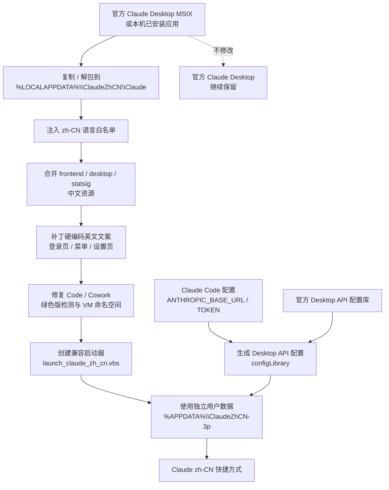
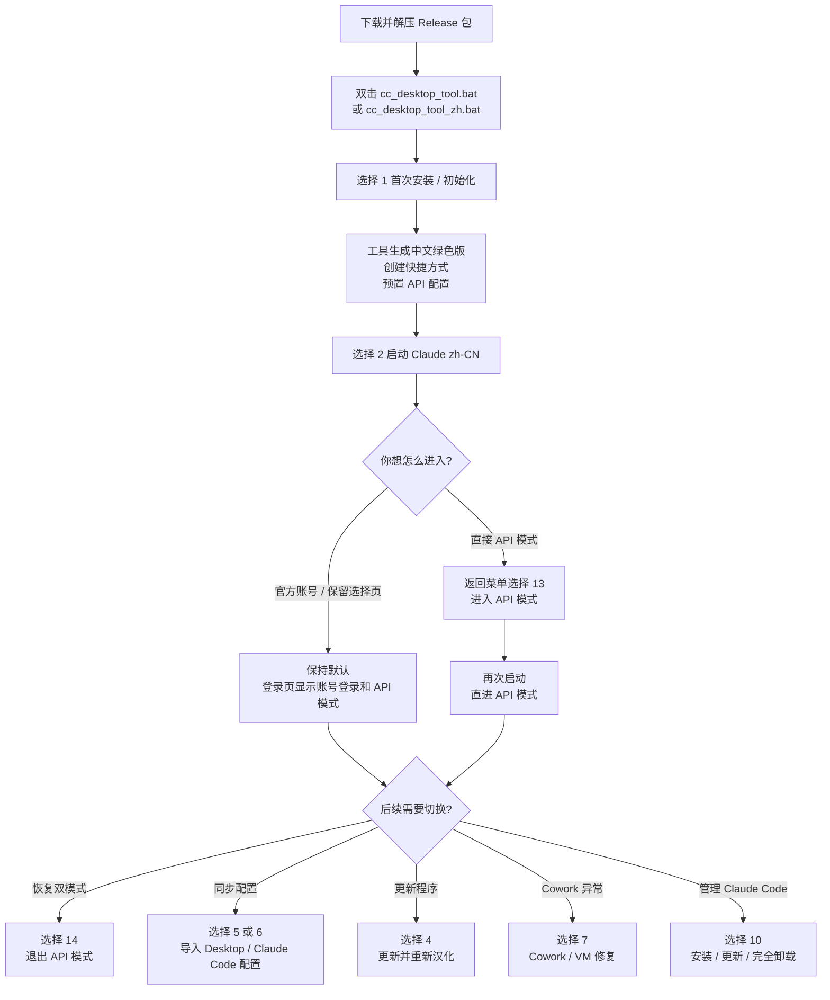
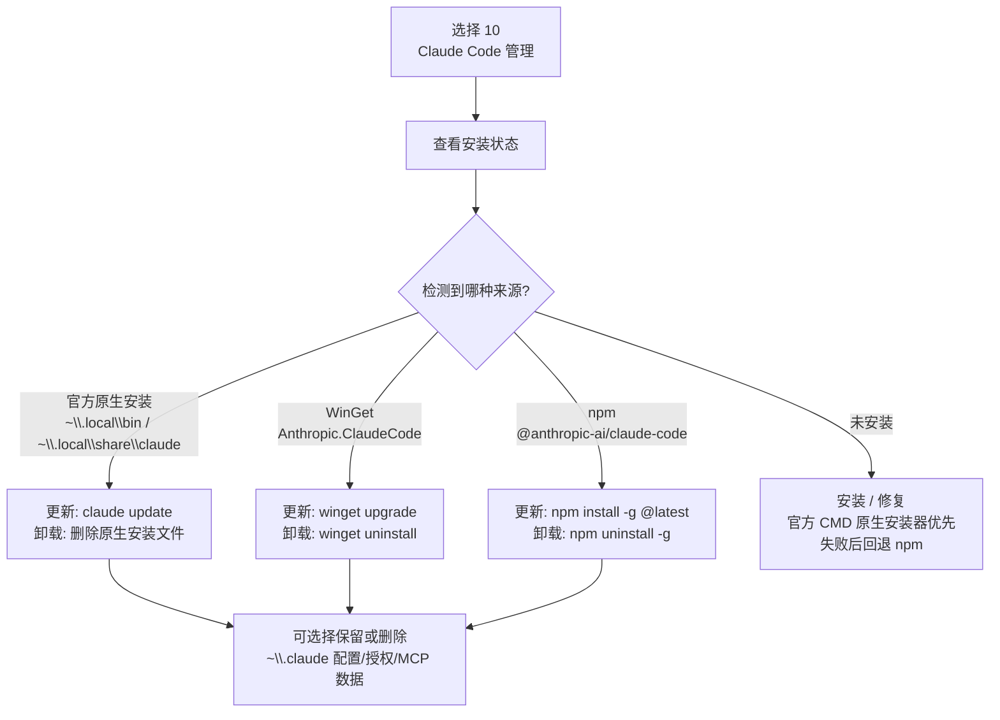

# WIN CC Desktop zh-CN Portable

一键生成可与官方安装版共存的中文绿色版 CC Desktop，并支持 Claude Desktop 的 API 模式配置。

当前版本：`v0.3.10`

它会从官方 Windows MSIX 或本机已安装应用生成一个独立中文副本，默认放在 `%LOCALAPPDATA%\ClaudeZhCN` 下运行。原版 Claude Desktop 不会被修改，汉化版和原版可以共存。

即使你没有安装过 Claude Desktop，也可以通过本工具下载官方 MSIX 并生成中文绿色版。仓库只包含补丁脚本和翻译资源，不包含官方应用、安装包、账号数据或访问令牌。

> CC 在本项目中指 Claude / Claude Code 相关桌面体验的缩写。本项目是独立社区工具，非官方项目。发布或使用前请阅读 [DISCLAIMER.md](DISCLAIMER.md)。

## v0.3.10 重点

- 补齐内置 Skill 的显示层中文名称和说明，同时保留内部命令 ID 为英文，默认技能列表和协作窗口仍能正常匹配。
- 优化顶部提示、技能入口和任务列表页中文细节，修复最近使用进入任务列表后部分英文文案回退。
- 重建快捷方式时会清理误指向绿色版 `Claude.exe` 的裸 `Claude.lnk`，避免绕过 `Claude zh-CN` 启动器；该清理只作用于 `%LOCALAPPDATA%\ClaudeZhCN` 下的绿色版入口，不会误删官方安装版快捷方式。

## v0.3.9 重点

- 进一步收窄硬编码文案替换范围，避免替换 `Skill`、`Skills`、`All` 等可能作为内部枚举使用的短字符串。
- 本地重新从缓存 MSIX 生成绿色版，确认内置技能相关 ID 保留英文，默认列表可恢复匹配。

## v0.3.8 重点

- 修复内置技能列表为空的问题：不再替换 `schedule`、`setup-cowork`、`context` 等内部技能 ID。
- 本地已用缓存 MSIX 重建绿色版并清理前端缓存，恢复默认内置技能显示。

## v0.3.7 重点

- 调整技能术语口径：独立术语显示为 `技能（Skill）`，操作入口保留自然中文。
- 保留 `Skills/*/SKILL.md` 等规范路径写法，避免专业语境丢失。

## v0.3.6 重点

- 优化顶部工具栏 tooltip、任务列表页和技能页的中文细节。
- 将技能相关菜单中的“技巧”统一为“技能”，并补齐内置技能名称与描述的中文兜底。

## v0.3.5 重点

- 兼容 Python 3.7.x 到当前最新版，修复旧版 Python 运行 Cowork / VM 修复时的 `zip()` 参数报错。
- 调整脚本类型注解写法，避免低版本 Python 或会求值注解的工具误判为 Python 3.9+ 语法。

## v0.3.4 重点

- 新增 `10. Claude Code 管理`：查看安装来源、安装/修复、更新和完全卸载 Claude Code。
- 自动识别 Claude Code 来源：官方原生安装、WinGet、npm 全局包或 PATH 中的未知来源。
- 安装默认使用官方 CMD 原生安装器，失败后回退 npm；每一步都会二次检测 `claude --version`，避免“提示完成但实际不可用”。
- 完全卸载会先卸程序，删除 `~\.claude` 等配置/授权/MCP 数据前会再次确认。

## v0.3.3 重点

- 修复设置页新 i18n key 漏翻导致的“改了但界面没变”问题。
- 补齐 `Avatar`、`Instructions for Claude`、`Preferences`、通知偏好说明等设置页文案。
- 补齐 API 模式隐私说明、Artifacts、Skills / Connectors 迁移提示、本地会话和自动 PR 设置页文案。
- 重新应用中文资源后会写入真实运行目录的 `ion-dist/i18n/zh-CN.json`；如 Claude 正在运行，建议重启以清掉旧缓存。

## v0.3.2 重点

- 深度润色 Claude Code / Cowork 运行界面文案，修复 `跑步`、`努力`、`型号`、`绕过权限` 等机翻问题。
- 将运行状态、模型菜单、推理强度菜单、操作权限菜单统一成更像中文产品的表达。
- 清理 `Code[代码]`、`Cowork[协作]`、`New session[新会话]` 等旧补丁痕迹，改为 `代码`、`协作`、`新会话`。
- 修复 `Webhook[被动接口]`、`OAuth[开放授权]`、`Bearer[令牌认证]` 等词典式括号标注。
- 重新应用中文资源时会迁移旧硬编码补丁残留，不需要重新安装绿色版。

## v0.3.1 重点

- 首次初始化会自动安装或修复绿色版，并预置可用 API 配置，但默认保留登录模式选择。
- 主菜单已经扩展为 14 项，`13. Enter API mode` 进入 API 模式，`14. Exit API mode` 恢复双入口。
- 登录页保留 Anthropic 账号登录和 API 模式两个入口，不再因为同步 API 配置就强制只显示一种模式。
- 需要直进 API 模式时，选主菜单 `13`；需要恢复双入口时，选主菜单 `14`。
- 修复 API 配置元数据备份时的 `UnboundLocalError: backup`。
- 补齐登录页中文提示，包括 `You can change this later by signing out.`、隐私政策提示和 `Or continue with Gateway`（或继续使用 API 模式使用）。
- 修复 Code / Cowork 的绿色版检测、独立用户数据目录、VM 命名空间和启动器兼容。

## 快速开始

下载 Release 包后解压，推荐双击英文入口：

```text
cc_desktop_tool.bat
```

中文入口也可以直接双击：

```text
cc_desktop_tool_zh.bat
```

如果你喜欢 PowerShell：

```powershell
cd C:\Users\TC\Downloads\claude-desktop-zh-cn-main
.\cc_desktop_tool.ps1
```

常用选择：

```text
1  首次安装 / 初始化：安装或修复绿色版，预置 API 配置，并保留登录模式选择
2  启动汉化版：直接打开当前 Claude zh-CN
4  更新并重新汉化：升级或重建中文绿色版
5  API 模式配置：导入、生成、查看 API 配置
10 Claude Code 管理：安装、更新、检测来源或完全卸载 Claude Code
13 进入 API 模式：使用已有 API 配置并隐藏账号登录入口
14 退出 API 模式：恢复 Anthropic 登录 / API 模式选择
```

首次完全卸载后重新使用时，通常只需要：

```text
1. 首次安装 / 初始化
2. 启动汉化版
```

如果已经同步了 API 配置，但启动后仍然停在模式选择页，这是正常的：`v0.3.2` 起默认保留双模式选择。想直接进入 API 模式，请在主菜单选择 `13`。

## 原理图


```mermaid
flowchart TD
    A["官方 Claude Desktop MSIX<br/>或本机已安装应用"] --> B["复制 / 解包到<br/>%LOCALAPPDATA%\\ClaudeZhCN\\Claude"]
    B --> C["注入 zh-CN 语言白名单"]
    C --> D["合并 frontend / desktop / statsig<br/>中文资源"]
    D --> E["补丁硬编码英文文案<br/>登录页 / 菜单 / 设置页"]
    E --> F["修复 Code / Cowork<br/>绿色版检测与 VM 命名空间"]
    F --> G["创建兼容启动器<br/>launch_claude_zh_cn.vbs"]
    G --> H["使用独立用户数据<br/>%APPDATA%\\ClaudeZhCN-3p"]
    H --> I["Claude zh-CN 快捷方式"]
    A -.->|不修改| J["官方 Claude Desktop<br/>继续保留"]
    K["Claude Code 配置<br/>ANTHROPIC_BASE_URL / TOKEN"] --> L["生成 Desktop API 配置<br/>configLibrary"]
    M["官方 Desktop API 配置库"] --> L
    L --> H
```

## 使用流程图


```mermaid
flowchart TD
    A["下载并解压 Release 包"] --> B["双击 cc_desktop_tool.bat<br/>或 cc_desktop_tool_zh.bat"]
    B --> C["选择 1 首次安装 / 初始化"]
    C --> D["工具生成中文绿色版<br/>创建快捷方式<br/>预置 API 配置"]
    D --> E["选择 2 启动 Claude zh-CN"]
    E --> F{"你想怎么进入?"}
    F -- "官方账号 / 保留选择页" --> G["保持默认<br/>登录页显示账号登录和 API 模式"]
    F -- "直接 API 模式" --> H["返回菜单选择 13<br/>进入 API 模式"]
    H --> I["再次启动<br/>直进 API 模式"]
    G --> J{"后续需要切换?"}
    I --> J
    J -- "恢复双模式" --> K["选择 14<br/>退出 API 模式"]
    J -- "同步配置" --> L["选择 5 或 6<br/>导入 Desktop / Claude Code 配置"]
    J -- "更新程序" --> M["选择 4<br/>更新并重新汉化"]
    J -- "Cowork 异常" --> N["选择 7<br/>Cowork / VM 修复"]
    J -- "管理 Claude Code" --> O["选择 10<br/>安装 / 更新 / 完全卸载"]
```

## Claude Code 管理

菜单 `10` 用来管理 Claude Code 本体，不会修改 Claude Desktop 的官方安装版，也不会影响本工具生成的 Claude zh-CN 程序。


```mermaid
flowchart TD
    A["选择 10<br/>Claude Code 管理"] --> B["查看安装状态"]
    B --> C{"检测到哪种来源?"}
    C -- "官方原生安装<br/>~\\.local\\bin / ~\\.local\\share\\claude" --> D["更新: claude update<br/>卸载: 删除原生安装文件"]
    C -- "WinGet<br/>Anthropic.ClaudeCode" --> E["更新: winget upgrade<br/>卸载: winget uninstall"]
    C -- "npm<br/>@anthropic-ai/claude-code" --> F["更新: npm install -g @latest<br/>卸载: npm uninstall -g"]
    C -- "未安装" --> G["安装 / 修复<br/>官方 CMD 原生安装器优先<br/>失败后回退 npm"]
    D --> H["可选择保留或删除<br/>~\\.claude 配置/授权/MCP 数据"]
    E --> H
    F --> H
```

## 完整菜单

英文菜单：

```text
1. First install / initialize - install/repair and preseed API config while keeping the mode chooser
2. Launch zh-CN Claude
3. Check for updates
4. Update / rebuild zh-CN portable Claude
5. API mode config
6. Import / sync config
7. Cowork / VM repair
8. Show paths / diagnostics
9. Shortcut manager
10. Claude Code manager
11. Clean / reset / uninstall
12. Dual launch / OAuth login repair
13. Enter API mode
14. Exit API mode
0. Exit
```

中文菜单：

```text
1. 首次安装 / 初始化 - 自动安装/修复，并预置 API 配置但保留登录模式选择
2. 启动汉化版 - 直接打开当前已生成的 Claude zh-CN，不检查更新
3. 检查更新 - 只比较官方最新版和本地汉化版版本，不下载、不修改
4. 更新并重新汉化一次 - 已安装后用于更新或强制重建中文绿色版
5. API 模式配置 - 配置/导入 API 地址和 API key，并可直进 API 模式
6. 导入 / 同步配置 - 在官方版、绿色版、Claude Code 之间双向同步配置，写入前备份
7. Cowork / VM 修复 - 修复 Cowork 启动、VM bundle、残留进程和官方沙箱问题
8. 查看路径 / 诊断 - 显示程序、用户数据、API 配置、快捷方式和 OAuth 回调位置
9. 快捷方式管理 - 创建或查看桌面/开始菜单快捷方式
10. Claude Code 管理 - 安装、更新、检测来源或完全卸载 Claude Code
11. 清理 / 重置 / 卸载 - 清理账号数据、程序副本、缓存或快捷方式
12. 双开 / OAuth 登录修复 - 官方版和汉化版都要登录账号时，临时接管登录回调
13. 进入 API 模式 - 使用已有 API 配置并隐藏账号登录入口
14. 退出 API 模式 - 恢复 Anthropic 登录/模式选择，保留 API 配置
0. 退出
```

## API 模式配置

菜单 `5` 用来处理 Desktop 的 `Developer -> Configure Third-Party Inference` 配置。首次初始化会尽量从 Claude Code 或已有 Desktop 配置预置 API 配置，但不会强制进入 API 模式。

向导提供：

```text
1. 保持全新：不导入、不修改 API 配置
2. 同步 Claude Desktop configLibrary：复用官方 Desktop 已配置好的 API 配置
3. 从 Claude Code 配置生成：读取 API 地址和访问令牌
4. 进入 API 模式：使用已有配置并隐藏账号登录入口
5. 退出 API 模式：恢复 Anthropic 账号登录 / API 模式选择
6. 只查看：显示检测到的配置来源和当前绿色版配置
```

可能读取的 Desktop 配置库：

```text
%APPDATA%\Claude-3p\configLibrary
%LOCALAPPDATA%\Packages\Claude_*\LocalCache\Roaming\Claude-3p\configLibrary
```

可能读取的 Claude Code 配置：

```text
%USERPROFILE%\.claude\settings.json
%USERPROFILE%\.claude\settings.local.json
```

识别字段：

```text
ANTHROPIC_BASE_URL
ANTHROPIC_AUTH_TOKEN
ANTHROPIC_API_KEY
```

写入目标是绿色版优先使用的配置库：

```text
%APPDATA%\ClaudeZhCN-3p\configLibrary
```

同步前会备份目标配置库到：

```text
%LOCALAPPDATA%\ClaudeZhCN\user-data-backups
```

两种同步方式不同：

- Desktop -> Desktop：复制同类 `configLibrary` JSON 文件，适合官方 Claude Desktop 已经配置成功的用户。
- Claude Code -> Desktop：读取 `ANTHROPIC_BASE_URL` 和访问令牌 / API key，再生成 Desktop API 配置。

导入或生成配置后，工具会保留 API 地址、凭据和认证方式。敏感值在控制台输出时会打码。

## 默认路径

绿色版应用：

```text
%LOCALAPPDATA%\ClaudeZhCN\Claude\Claude.exe
```

下载缓存：

```text
%LOCALAPPDATA%\ClaudeZhCN\downloads\Claude-latest.msix
```

启动器：

```text
%LOCALAPPDATA%\ClaudeZhCN\launch_claude_zh_cn.vbs
```

用户数据：

```text
%APPDATA%\ClaudeZhCN-3p
%APPDATA%\ClaudeZhCN
%APPDATA%\Claude
%APPDATA%\Claude-3p
%LOCALAPPDATA%\Packages\Claude_*\LocalCache\Roaming\Claude
%LOCALAPPDATA%\Packages\Claude_*\LocalCache\Roaming\Claude-3p
```

快捷方式：

```text
桌面\Claude zh-CN.lnk
桌面\Claude Code.lnk
开始菜单\Claude zh-CN.lnk
开始菜单\Claude Code.lnk
```

`Claude Code.lnk` 只有在本机能找到 `claude` 命令时才会自动创建。

## 更新逻辑

菜单 `4` 会先检查官方最新版和本地绿色副本版本。

如果版本一致，工具会跳过下载和重建，只重新应用中文资源、用户界面设置、Cowork 兼容修复和快捷方式。

如果版本不同，工具会询问是否更新。确认后会下载官方最新版 MSIX，备份旧绿色副本，并重新生成新的中文副本。

如果官方下载接口返回 403 或版本检查失败，菜单会尝试回退到本机已安装的 Claude Desktop 继续生成绿色版。没有安装官方版时，可以稍后重试下载，或手动提供 MSIX。

## 导入 / 同步配置

菜单 `6` 用于处理官方 Desktop、绿色版、旧绿色版和 Claude Code 之间的配置复用。它支持：

```text
1. 扫描并显示可同步的数据空间
2. 官方 Desktop -> 绿色版
3. 绿色版 -> 官方 Desktop
4. 自选来源和目标同步轻量用户数据
5. 同步 API 配置库到绿色版
6. 同步绿色版 API 配置库到官方 Desktop
7. 从 Claude Code 生成绿色版 API 配置
```

轻量用户数据同步会尽量包含登录态、Local Storage、IndexedDB、`configLibrary`、MCP / 应用配置等，但默认排除：

```text
vm_bundles
```

这是为了避免每个配置空间额外复制一套 Cowork VM。当前 Claude Cowork / VM bundle 通常会占用 10GB 以上。需要修复 Cowork 时，请使用菜单 `7`，而不是通过同步配置复制 VM。

如果没有检测到可复用配置，工具只会提示，不会写入空配置。

## Code / Cowork

Windows 版本的 Code / Cowork 页面会检测应用是否通过 MSIX / WindowsApps 路径启动。绿色版是解包运行，可能出现：

```text
Cowork requires Claude Desktop be installed with our modern installer
```

菜单 `7` 会把该检测改为读取绿色版专用环境变量，并同步更新 ASAR 完整性信息与 `Claude.exe` 中记录的 ASAR hash。

为了让官方 MSIX 版和中文绿色版可以同时运行，工具还会把绿色版的 Cowork VM 命名空间改成独立名称：

```text
cowork-vm-service -> ccdesk-vm-service
cowork-vm-nat     -> ccdesk-vm-nat
cowork-vm-store   -> ccdesk-vm-store
```

这会同时处理 `app.asar` 和 `resources\cowork-svc.exe`，并重建启动器。启动 `Claude zh-CN` 快捷方式时，启动器会先启动绿色版自己的 `cowork-svc.exe`，等待 `\\.\pipe\ccdesk-vm-service` 就绪后，再用 `--user-data-dir=%APPDATA%\ClaudeZhCN-3p` 打开 Claude。

请通过桌面或开始菜单中的 `Claude zh-CN` 快捷方式启动。不要直接双击绿色副本里的 `Claude.exe`，否则可能绕过启动器环境变量和独立用户数据参数。

菜单 `7` 里的官方 MSIX 高级修复项，只用于官方 MSIX 版在使用绿色版后出现 Cowork 启动失败的情况。默认汉化 / 更新流程不会自动触碰官方版沙箱数据。

## 双开 / OAuth 登录修复

官方 Claude Desktop 和汉化绿色版可以各自使用账号登录或 API 模式。官方版如何登录不归本工具管理；汉化版默认使用独立用户数据目录：

```text
%APPDATA%\ClaudeZhCN-3p
```

如果官方版已经使用 OAuth 登录，而汉化版也要通过 Google / 浏览器 OAuth 登录，浏览器完成登录后的 `claude://` 回调可能会被官方版接走。菜单 `11` 可以：

```text
1. 查看当前 claude:// 回调指向
2. 备份当前协议处理器，并临时指向汉化版启动器
3. 启动汉化版完成 OAuth 登录
4. 登录完成后恢复原协议处理器
```

启动器会把浏览器传入的 `claude://...` URL 原样转交给汉化版 `Claude.exe`，并同时带上 `--user-data-dir=%APPDATA%\ClaudeZhCN-3p`。这样登录态会写入绿色版独立空间，而不是官方空间。

## 清理

菜单 `10` 的子选项 `1` 会清理用户配置 / 账号数据。清理时不是永久删除，而是移动到：

```text
%LOCALAPPDATA%\ClaudeZhCN\user-data-backups
```

这会让应用下次启动时重新创建用户数据目录，通常需要重新登录。

菜单 `10` 的子选项 `2` 会删除绿色版相关文件，但保留用户数据和备份：

```text
%LOCALAPPDATA%\ClaudeZhCN\Claude
%LOCALAPPDATA%\ClaudeZhCN\launch_claude_zh_cn.vbs
%LOCALAPPDATA%\ClaudeZhCN\downloads
桌面\Claude zh-CN.lnk
桌面\Claude Code.lnk
开始菜单\Claude zh-CN.lnk
开始菜单\Claude Code.lnk
```

菜单 `10` 的子选项 `3` 会一并清理程序和用户数据，属于危险操作，执行前会要求确认。

## 文件说明

- `cc_desktop_tool.bat`：英文菜单双击入口。
- `cc_desktop_tool.ps1`：英文菜单脚本，兼容性最好。
- `cc_desktop_tool_zh.bat`：中文菜单双击入口。
- `cc_desktop_tool_zh.ps1`：中文菜单脚本。
- `cc_desktop_zh_cn_windows.py`：核心补丁脚本。
- `resources/frontend-zh-CN.json`：前端中文翻译。
- `resources/desktop-zh-CN.json`：桌面壳层中文翻译。
- `resources/statsig-zh-CN.json`：statsig 中文资源。
- `CHANGELOG.md`：版本更新记录。
- `LICENSE`：MIT License。
- `DISCLAIMER.md`：免责声明。

## 开源发布注意事项

不要提交以下内容：

- 官方安装包、MSIX、APPX。
- 解包后的官方应用目录。
- `%LOCALAPPDATA%\ClaudeZhCN` 里的运行时文件、下载缓存或备份。
- `%APPDATA%\ClaudeZhCN-3p`、`%APPDATA%\ClaudeZhCN`、`%APPDATA%\Claude`、`%APPDATA%\Claude-3p` 或 `%USERPROFILE%\.claude` 中的账号数据、访问令牌、API key。
- 任何本地 `.env`、`settings.local.json`、日志、缓存。

## 参考与致谢

本项目的中文资源整理与补丁思路参考了 [javaht/claude-desktop-zh-cn](https://github.com/javaht/claude-desktop-zh-cn)。感谢原项目作者和贡献者对 Claude Desktop 中文化实践的探索与分享。

感谢 [@chrichuang218](https://github.com/chrichuang218) 的 fork 和 PR 对翻译修正、API 配置复用、下载回退以及 Cowork 共存修复思路提供的改进参考。本项目已在保留用户选择权和配置备份的前提下吸收相关优点。

本项目在此基础上面向 Windows 绿色版 / 便携化使用场景做了独立实现与扩展。

## License

MIT. See [LICENSE](LICENSE).

## 友情链接

- [LINUX DO](https://linux.do/)
